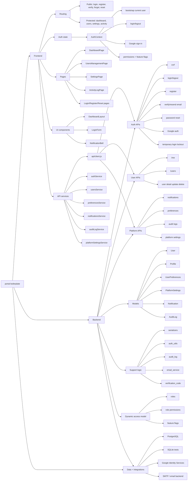

# Project Feature Flowchart

```mermaid
flowchart LR
  A["portal boilerplate"]

  A --> B["Frontend"]
  A --> C["Backend"]
  A --> D["Data + Integrations"]

  B --> B1["Routing"]
  B --> B2["Auth state"]
  B --> B3["Pages"]
  B --> B4["UI components"]
  B --> B5["API services"]

  B1 --> B1a["Public: login, register, verify, forgot, reset"]
  B1 --> B1b["Protected: dashboard, users, settings, activity"]

  B2 --> B2a["AuthContext"]
  B2a --> B2b["bootstrap current user"]
  B2a --> B2c["login/logout"]
  B2a --> B2d["Google sign-in"]
  B2a --> B2e["permissions + feature flags"]

  B3 --> B3a["DashboardPage"]
  B3 --> B3b["UsersManagementPage"]
  B3 --> B3c["SettingsPage"]
  B3 --> B3d["ActivityLogPage"]
  B3 --> B3e["Login/Register/Reset pages"]

  B4 --> B4a["DashboardLayout"]
  B4 --> B4b["LoginForm"]
  B4 --> B4c["NotificationBell"]

  B5 --> B5a["api/client.js"]
  B5 --> B5b["authService"]
  B5 --> B5c["usersService"]
  B5 --> B5d["preferencesService"]
  B5 --> B5e["notificationsService"]
  B5 --> B5f["auditLogService"]
  B5 --> B5g["platformSettingsService"]

  C --> C1["Auth APIs"]
  C --> C2["User APIs"]
  C --> C3["Platform APIs"]
  C --> C4["Models"]
  C --> C5["Support logic"]
  C --> C6["Dynamic access model"]

  C1 --> C1a["csrf"]
  C1 --> C1b["login/logout"]
  C1 --> C1c["register"]
  C1 --> C1d["verify/resend email"]
  C1 --> C1e["password reset"]
  C1 --> C1f["Google auth"]
  C1 --> C1g["temporary login lockout"]

  C2 --> C2a["/me"]
  C2 --> C2b["/users"]
  C2 --> C2c["user detail update delete"]

  C3 --> C3a["notifications"]
  C3 --> C3b["preferences"]
  C3 --> C3c["audit logs"]
  C3 --> C3d["platform settings"]

  C4 --> C4a["User"]
  C4 --> C4b["Profile"]
  C4 --> C4c["UserPreferences"]
  C4 --> C4d["PlatformSettings"]
  C4 --> C4e["Notification"]
  C4 --> C4f["AuditLog"]

  C5 --> C5a["serializers"]
  C5 --> C5b["auth_utils"]
  C5 --> C5c["audit_log"]
  C5 --> C5d["email_service"]
  C5 --> C5e["verification_code"]

  C6 --> C6a["roles"]
  C6 --> C6b["role permissions"]
  C6 --> C6c["feature flags"]

  D --> D1["PostgreSQL"]
  D --> D2["SQLite tests"]
  D --> D3["Google Identity Services"]
  D --> D4["SMTP / email backend"]

  B5a --> C1
  B5a --> C2
  B5a --> C3
  C --> D
```
