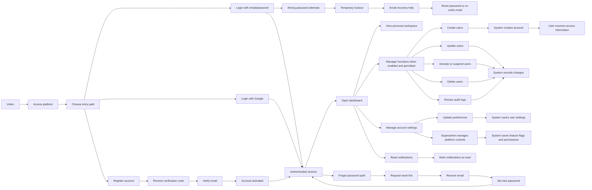

# Business Flowchart

```mermaid
flowchart LR
  A["Visitor"] --> B["Access platform"]

  B --> C["Choose entry path"]
  C --> C1["Register account"]
  C --> C2["Login with email/password"]
  C --> C3["Login with Google"]

  C1 --> D["Receive verification code"]
  D --> E["Verify email"]
  E --> F["Account activated"]

  C2 --> G["Authenticated session"]
  C3 --> G
  F --> G

  C2 --> C2a["Wrong password attempts"]
  C2a --> C2b["Temporary lockout"]
  C2b --> C2c["Email recovery help"]
  C2c --> C2d["Reset password or re-verify email"]

  G --> H["Open dashboard"]

  H --> I["View personal workspace"]
  H --> J["Manage account settings"]
  H --> K["Read notifications"]

  H --> L["Manager functions when enabled and permitted"]
  L --> L1["Create users"]
  L --> L2["Update users"]
  L --> L3["Activate or suspend users"]
  L --> L4["Delete users"]
  L --> L5["Review audit logs"]

  L1 --> M["System creates account"]
  M --> N["User receives access information"]

  L2 --> O["System records changes"]
  L3 --> O
  L4 --> O
  L5 --> O

  J --> P["Update preferences"]
  J --> P2["Superadmin manages platform controls"]
  P --> Q["System saves user settings"]
  P2 --> Q2["System saves feature flags and permissions"]

  K --> R["Mark notifications as read"]

  G --> S["Forgot password path"]
  S --> T["Request reset link"]
  T --> U["Receive email"]
  U --> V["Set new password"]
  V --> G
```
